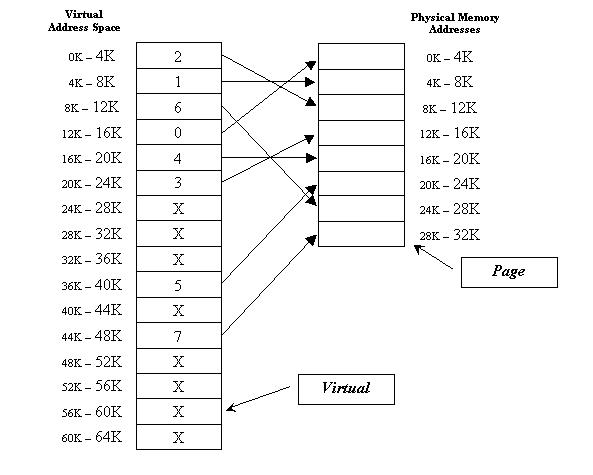

# ECE-562 Software

The basic idea:

[http://www.cs.nott.ac.uk/~pszgxk/courses/g53ops/Memory%20Management/MM10-paging.html]

All modules are in python3

## Installation

TODO: Describe the installation process

## Usage

TODO: Write usage instructions

## Contributing

1. Clone it
2. Create your development branch: `git checkout -b dev-NAME`
3. Commit your changes: `git commit -am 'Add some feature'`
4. Push to the branch: `git push origin dev-NAME`
5. Test your new features plus all existing features
6. Merge with mainline

See file MVC-classes for specification on main classes

## License
Unless stated otherwise all works are licensed under:

<ul><li><a href="http://spdx.org/licenses/MIT.html">MIT License</a></li></ul>

<!-- /LICENSE -->
